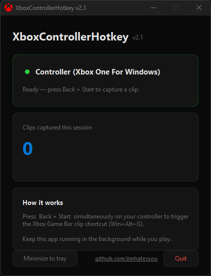

# XboxControllerHotkey v2.1

A lightweight Windows app that lets you clip the last 60 seconds of 
gameplay using your Xbox Controller — no mouse needed.

## How it works

Press **Back + Start** simultaneously on your Xbox controller to trigger
the Xbox Game Bar clip shortcut (`Win + Alt + G`). Keep the app running
in the background while you play.

## Features

- Detects connected Xbox controller automatically
- Captures clips with a single button combo
- Runs silently in the system tray
- Clip counter tracks captures per session
- Refreshed dark UI in v2.1

## Requirements

- Windows 10/11
- Xbox controller (wired or wireless)
- Xbox Game Bar enabled

## How to run

1. Download and run `xbox_dvr_recorder_gui.py` or the compiled `.exe`
2. Keep the app running in the background
3. Press **Back + Start** on your controller to save a clip

## Credits

Originally created by [jimhatesyou](https://github.com/jimhatesyou).  
Forked and updated GUI by [JBW2023](https://github.com/JBW2023).
